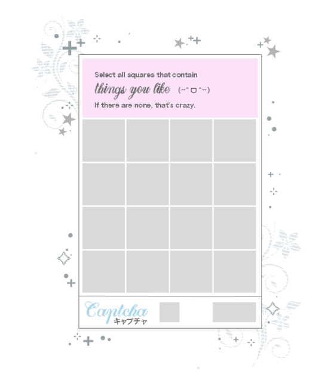
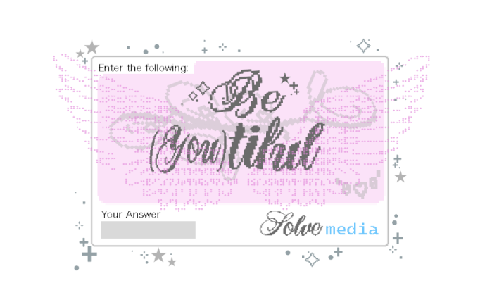
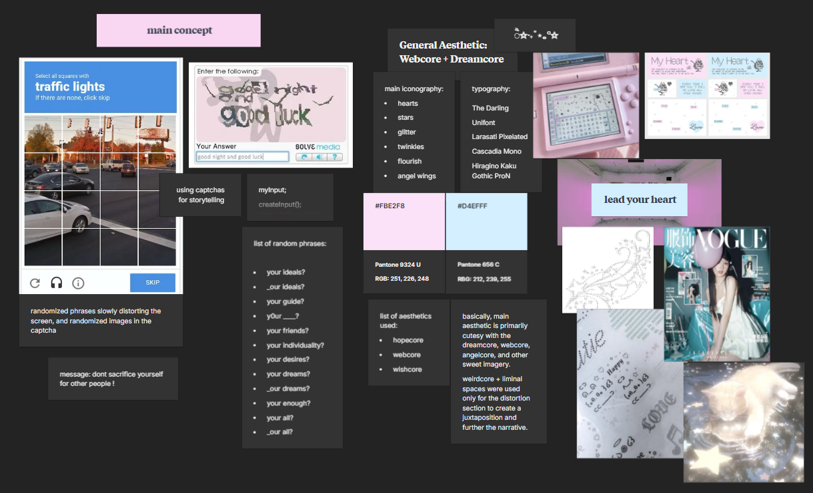

# be-you-tiful

a more conceptual project about loving all aspects of yourself.
you can probably guess why i intentionally picked a Captcha and SolveMedia as the main "mechanic"
main inspirations is from a j-pop music video, "Too Bad" by NiziU and Elizabeth Nguyen's "You are Not Alone". sub-inspo is the Y2K boom of K-pop and hopecore music.
(all of my projects throughout my CSUEB journey had k-pop/j-pop references)

the grid made me wanna pull my hair out. i had to ask my big brother and look through excel tutorials weirdly.

## wireframe
below are the two crude wireframe. simple because i mainly focused on SolveMedia and Captcha.

 

## mood board
and here is the moodboard! i decided to keep it safe with aesthetics im familiar with and tried to focus more on the coding. (the amount of hair pulling... how am i not bald?) webcore and hopecore are the main aesthetics with an emphasis on dreamy and soft collection of images for the Captcha.
> motifs are mainly stars, glitter, flourishes, and ASCII art.
> color palette consists of mainly pale pink, baby blue, greys, and a bit of black. 
> i listed the fonts used in making the assets. (had a lot of fun sifting through fonts)

> originally i was going to add in weirdcore as well, but i scrapped it because it felt too eclectic against the softer aesthetic and overall message i wanted to convey.

## future updates (if i ever get to it)
- sfxs! i had a nice sound file i wanted to use for the asset loading but i didnt have enough time (or eneergy)
- smoother animations: for captcha selection
- click particles: for maximum cuteness
- custom buttons: i ended up using the provided buttons since it was more easier. fits the aesthetic but having custom buttons is fun
- expansive img library: maybe? LOL
